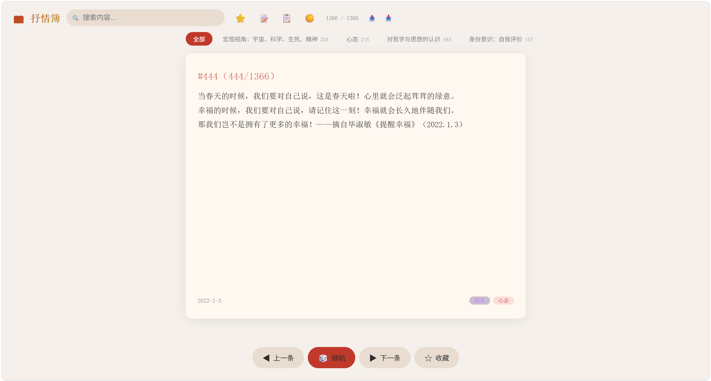

# 抒情簿

个人思考记录阅读器 — PWA 应用



## 维护流程

修改 Excel 后：

```
双击 export.bat    → 将 Excel 转为 entries.json
双击 serve.bat     → 启动本地服务器供调试
```

然后 commit & push 到 GitHub：

```
git add -A
git commit -m "更新"
git push
```

等待 1-2 分钟，手机打开 https://greensweet233.github.io/ShuQingBu/ 即可看到更新。

## 文件说明

| 文件 | 用途 |
|------|------|
| `export.bat` | Excel → JSON 转换（双击运行） |
| `serve.bat` | 启动本地 HTTP 服务器（端口 8080） |
| `scripts/export_json.py` | Excel → JSON 转换脚本 |
| `index.html` | PWA 主页面 |
| `data/entries.json` | 条目数据（自动生成，勿手动编辑） |
| `sw.js` | Service Worker（离线缓存） |
| `manifest.json` | PWA 安装清单 |

## 手机安装

打开 https://greensweet233.github.io/ShuQingBu/ → Edge 菜单 → 添加到手机 → 安装
